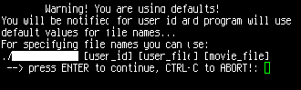
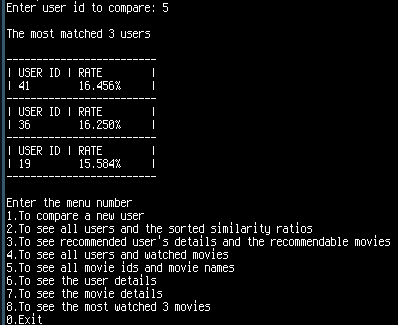
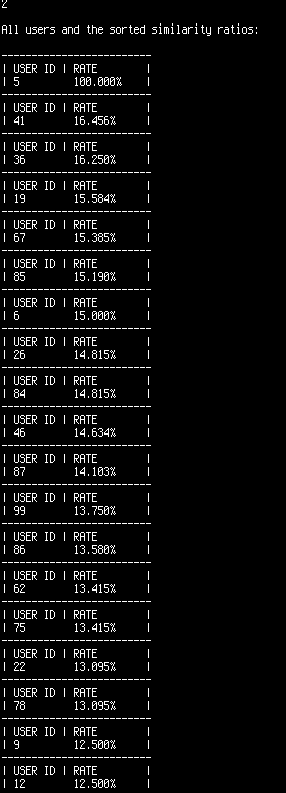
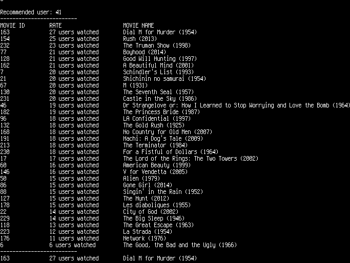
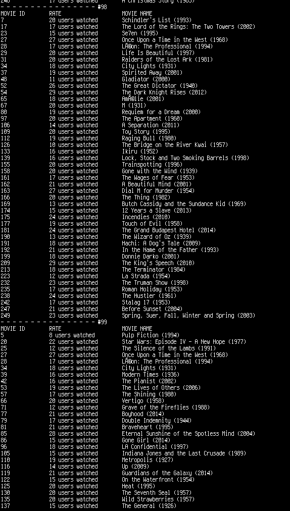
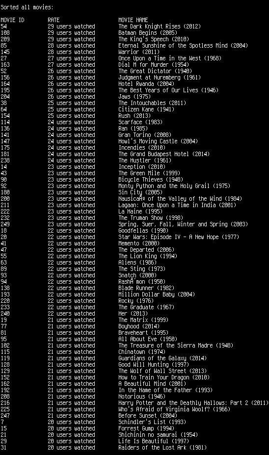
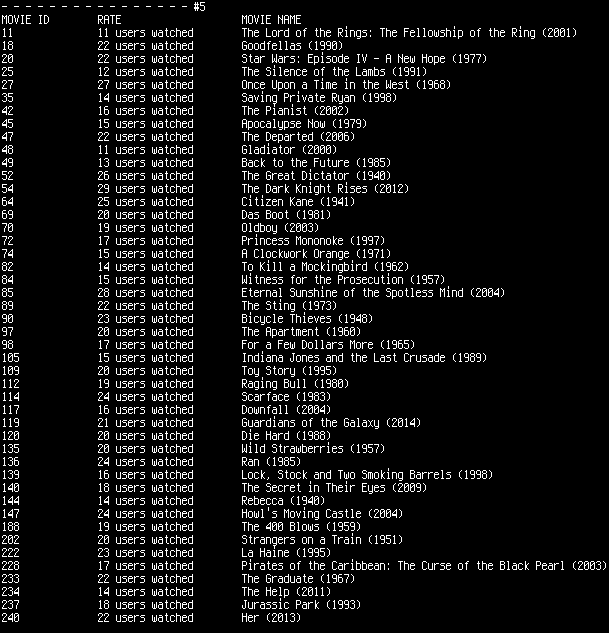
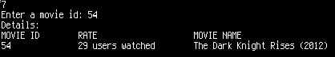
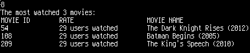
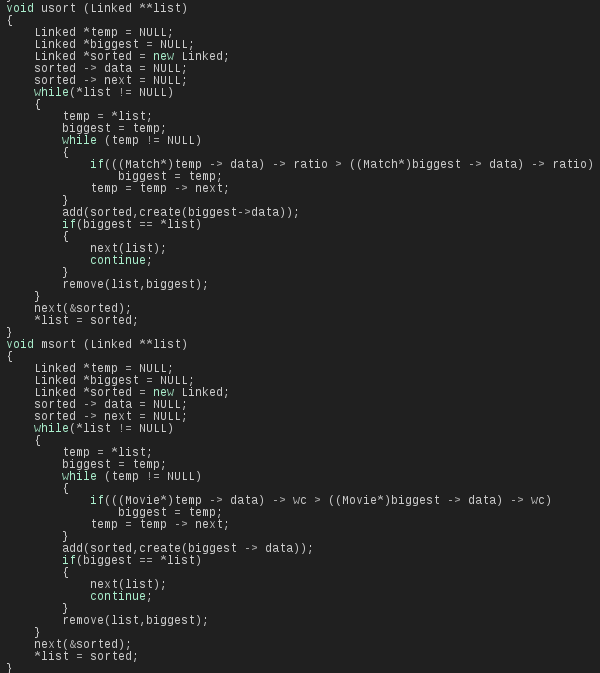

# Movie Advisor

<div style="text-align: justify">


## Usage

For macOS and Linux users, there is a makefile. After downloading the repository folder, you can execute command below. It will compile the source code and create an output file.
```
make
```
To delete the existing output file, you can execute command below.
```
make clean
```
Otherwise, you can compile it without using makefile.
```
g++ user/user.cpp movie/movie.cpp libs/linked.cpp main.cpp -o source
```
To execute,
```
./source
```


In this readme file, I am going to try to explain how the movie advisor works. This instruction is divided into two parts. In the first part, I will show you some screenshots about what the features are included and how it runs. In the second part, I will show you how the sorting algorithm works.

<p align="center"> 



</p>

This is the beginning of the program. There are some options. If there is no input arguments after the output file's name, the program will use default values. However, user can use some specific files and id values. For instance, if user type on console this `./source 5`, the program will compare the fifth user to the all other users. If you want, you can specify the file names such as `clients.txt` instead of `clients-preference.txt` by using the command below

```./source 5 clients.txt movie.txt```.

<p align="center"> 



</p>


Now, we entered 5 to compare. And program returned the most matched 3 users by using sorting algorithm. There are 8 options in the menu, as it is mentioned above. If we enter the menu option 1, the program asks us a user id and runs it again.

<p align="center"> 



</p>

As you can see, the menu option 2 shows us all compared users and their similarity rates.


<p align="center"> 



</p>

The menu option 3 finds the most matched users and sorts their movies. Finally, it returned us the most watched movies as recommended movies.

<p align="center"> 



</p>

In the menu option 4, the program shows us all users and their information.

<p align="center"> 



</p>

In the menu option 5, all movies will be sorted and printed.

<p align="center"> 



</p>

In the menu option 6, the user’s watched movies are printed as sorted by movie id.

<p align="center"> 



</p>

In the menu option 7, program asks a movie id to show us the movie details.

<p align="center"> 



</p>

In the menu option 8, program shows the most watched 3 movies.

In this part, I will explain how my sorting algorithm works. First, there is a picture of my algorithm below.

<p align="center"> 



</p>

usort function takes double pointer. Because it finds the biggest value in the temp linkedlist and move the biggest linkedlist. Then, add the biggest values to the sorted linkedlist. For example, we have a linkedlist consists of 11, 54, 3, 1, 99. We check the biggest value. Biggest is 11 now. 11 > 11 , 54 > 11 biggest = 54, 3 > 54, 1 > 54, 99 > 54 biggest is 99. So, 99 is the biggest and move to the sorted linkedlist. Then, remove 99. Again, it runs and at the end, there is no number in the temp linkedlist. And the sorted linkedlist is 99, 54, 11, 3, 1.

In conculusion, there are a lot of programs like this program but the most important difference is that this program runs with minimum ram capacity and there is no garbage value. It runs fast, it has a feature that checks inaccurate value inputs and it has a menu which consists of 8 different options.


</div>
